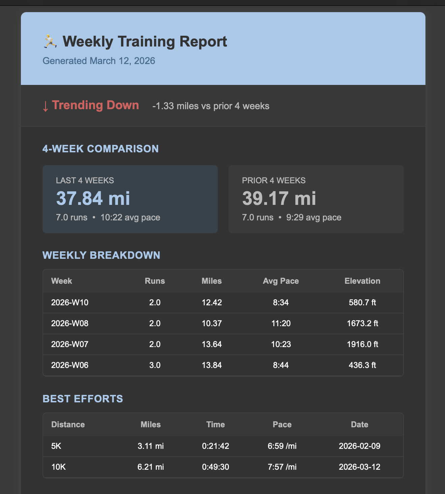

# Strava Training Insights

A serverless AWS pipeline that pulls your Strava run data, analyzes training trends, and delivers a formatted weekly report to your inbox — built with Python, AWS Lambda, S3, DynamoDB, and Terraform.

## Screenshot

## What It Does

- **Fetches** recent runs from the Strava API with automatic OAuth token refresh
- **Stores** raw activity JSON in S3 for full auditability and replay
- **Analyzes** training across three dimensions:
  - Weekly mileage, pace, and elevation summaries (last 12 weeks)
  - Performance trends comparing recent vs prior 4-week blocks
  - Best efforts using **GPS stream analysis** — finds your fastest 5K segment within any longer run via a sliding window algorithm
- **Emails** a formatted HTML report every Monday via AWS SES
- **Deploys automatically** on push to `main` via GitHub Actions

## Architecture

\`\`\`
EventBridge (Mon 8:00 AM)          EventBridge (Mon 8:30 AM)
        │                                    │
        ▼                                    ▼
AWS Lambda — Insights Pipeline    AWS Lambda — Email Reporter
   ├── Strava API ──► fetch runs      ├── DynamoDB ──► load summary
   ├── S3          ◄── raw JSON       └── SES      ──► HTML email
   ├── DynamoDB    ◄── summaries
   └── CloudWatch  ── logs
\`\`\`

## Tech Stack

| Layer | Technology |
|---|---|
| Runtime | Python 3.12 |
| Compute | AWS Lambda (x2) |
| Storage | S3 (raw), DynamoDB (summaries) |
| Email | AWS SES |
| Scheduling | EventBridge (cron) |
| IaC | Terraform with S3 remote state |
| CI/CD | GitHub Actions |
| External API | Strava API v3 (OAuth 2.0) |

## How Best Efforts Work

Fetches the GPS time/distance stream for each eligible run and uses a two-pointer sliding window to find the fastest segment of each target distance within any longer run — the same way Garmin and Strava compute native best splits.

\`\`\`python
for right in range(1, len(dist_data)):
    window_dist = dist_data[right] - dist_data[left]
    while window_dist > target_distance_m and left < right - 1:
        left += 1
        window_dist = dist_data[right] - dist_data[left]
    if window_dist >= target_distance_m:
        elapsed = time_data[right] - time_data[left]
        if elapsed < best_time:
            best_time = elapsed
\`\`\`

## Deploy

\`\`\`bash
cd terraform
terraform init
terraform apply \
  -var="strava_client_id=YOUR_CLIENT_ID" \
  -var="strava_client_secret=YOUR_CLIENT_SECRET" \
  -var="strava_refresh_token=YOUR_REFRESH_TOKEN" \
  -var="report_email_to=you@example.com" \
  -var="report_email_from=you@example.com"
\`\`\`

## Project Structure

\`\`\`
strava-insights/
├── src/
│   ├── handler.py          # Insights Lambda — fetches, analyzes, stores
│   ├── reporter.py         # Reporter Lambda — builds and emails report
│   ├── strava_client.py    # Strava API client + OAuth + stream fetching
│   ├── analyzer.py         # Weekly summaries, trends, sliding window best efforts
│   └── storage.py          # S3 + DynamoDB helpers
├── terraform/              # All AWS infrastructure as code
├── tests/                  # Unit tests (pytest)
├── screenshots/
│   └── weekly_report.png
└── .github/workflows/
    └── deploy.yml          # CI/CD pipeline
\`\`\`
